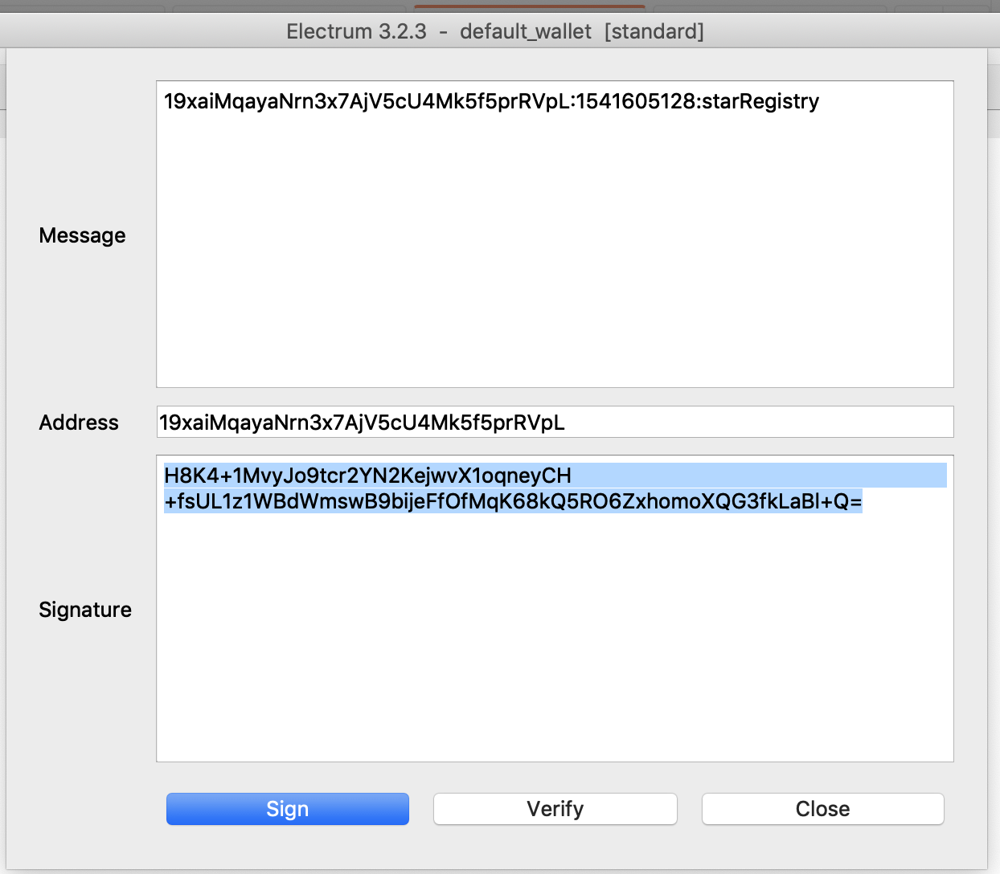

# Private Blockchain

Project for Udacity Blockchain developer Nanodegree.

## Getting Started

1. Clone or download the project.
2. Open the project on terminal.
3. Run `yarn` to install the dependencies.
4. Run `yarn start` to run the application.

## Frameworks

The framework for the API is `express`.

## Open Endpoints

* [requestValidation](./markdowns/requestValidation.md) : `POST /requestValidation`
* [validateMessageSignature](./markdowns/validateMessageSignature.md) : `POST /message-signature/validate`
* [addBlock](./markdowns/addBlock.md) : `POST /block`
* [validateChain](./markdowns/validateChain.md) : `GET /validateChain`
* [getBlockByHash](./markdowns/getBlockByHash.md) : `GET /stars/hash:[HASH]`
* [getBlockByWalletAddress](./markdowns/getBlockByWalletAddress.md) : `GET /stars/address/:[ADDRESS]`
* [getBlockByHeight](./markdowns/getBlockByHeight.md) : `GET /block/:[HEIGHT]`

## Hints

1. Start out by submitting a validation request [requestValidation](./markdowns/requestValidation.md).
2. Then send a validation request [validateMessageSignature](./markdowns/validateMessageSignature.md).
3. Use your electrum wallet, sign the message with the wallet address you use to submit your request.

4. Send star data to be stored [addBlock](./markdowns/addBlock.md).

## Authors

* **Alan Mortoni** - *Initial work*
